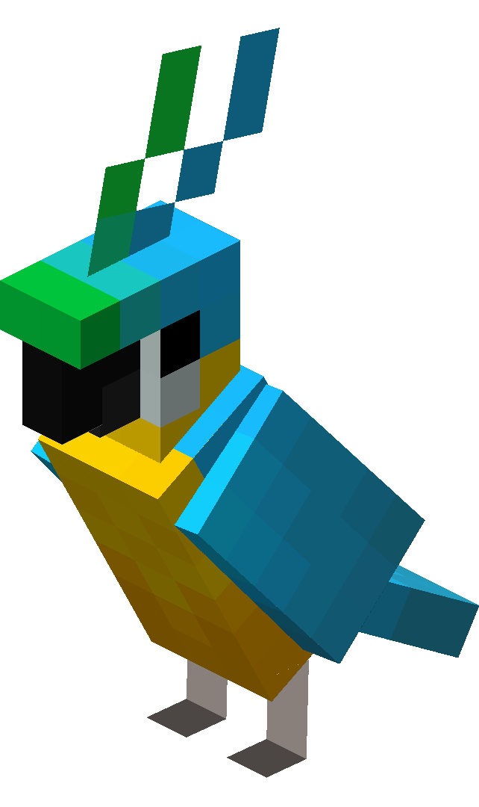

# parrot

Exposes Minecraft RCON as a REST API. Driven by subprocess calls to [Tiiffi/mcrcon](https://github.com/Tiiffi/mcrcon).

## Installation + Usage

- Clone repo
- `pip3 install -r requirements.txt`
- `mkdir ~/.parrot-mc`
- Update configuration:
  - (Option 1): Create a config.ini file

    `cp config.example.ini ~/.parrot-mc/config.ini`
  
  - (Option 2): Specify these environment variables at runtime: `MCRCON_HOST`, `MCRCON_PORT`, `MCRCON_PASS`.

- Run the server:
  
  `gunicorn server:app`

- Access the server: `http://127.0.0.1:8000/`

## API

### `GET /`
### `GET /api/cmd/<command>`
### `GET /api/list`
### `GET /api/slots`
